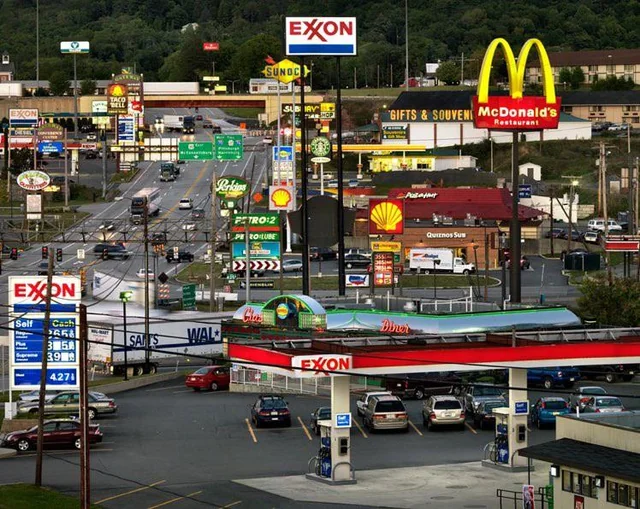

title: Capitalism Is Killing Design
banner: assets/motor.webp

The question I seek to answer today is: To what extent does capitalism shape and limit the role of aesthetics and design in consumer products and how does that affect us?

# A Profit Driven Economy
The function of our economy in society is incredibly influential. In the context of our current economic system, we place a large emphasis on profit and seeking monetary success. We’re missing even a hint of the drive to create great things that we once had. To be clear, this isn’t capitalism in its infancy, an economic system of the past, built on the work of artisans and craftsman who took pride in what they built; this is late stage capitalism, a system so far gone and optimized for profit extraction that even the pretense of care for the product has been foregone.

## The Disastrous Effects
In the pursuit of this shallow goal, we’ve sacrificed much. Art and design are just one of the many victims. The real tragedy is that we don’t even realize it. 

Capitalism has systematically eliminated the risk that great design requires, and in doing so impoverishes not just our aesthetics but how we think and who we become. I hope to prove to you the power design can hold, beyond just an afterthought or vehicle for function.
