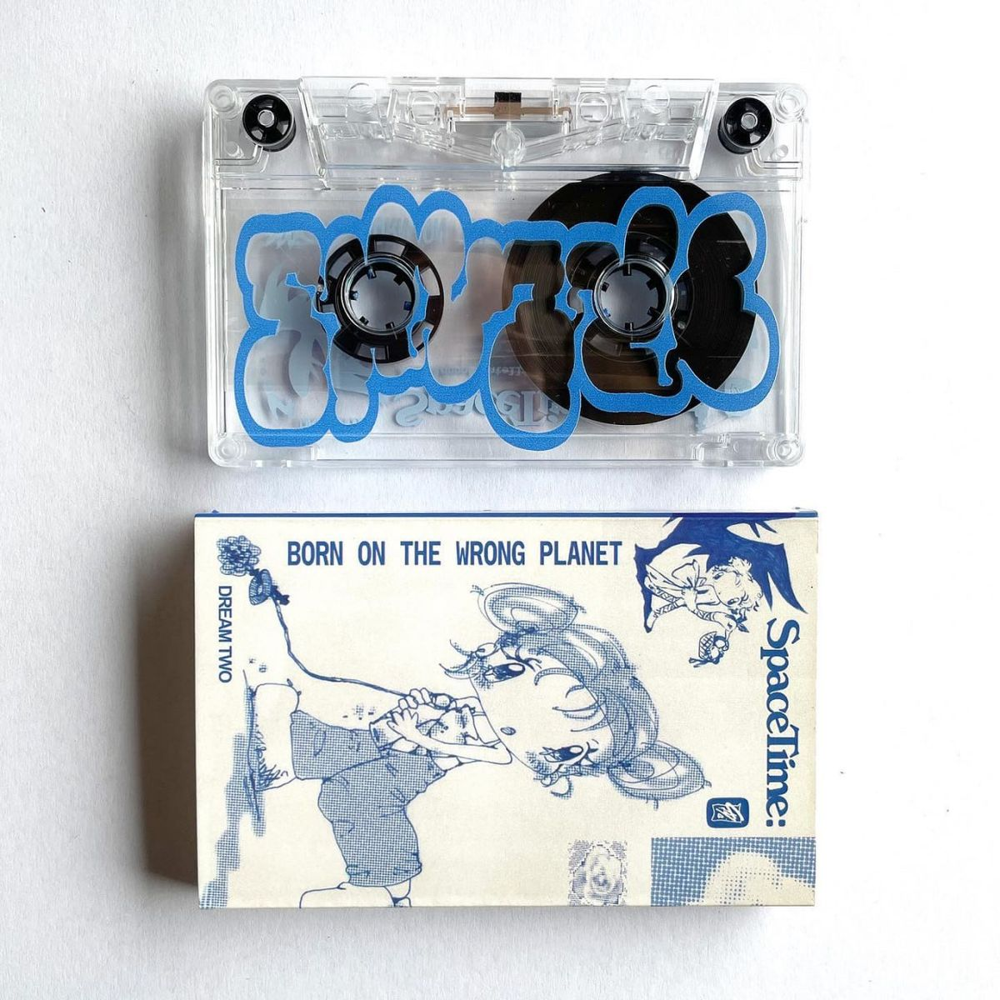
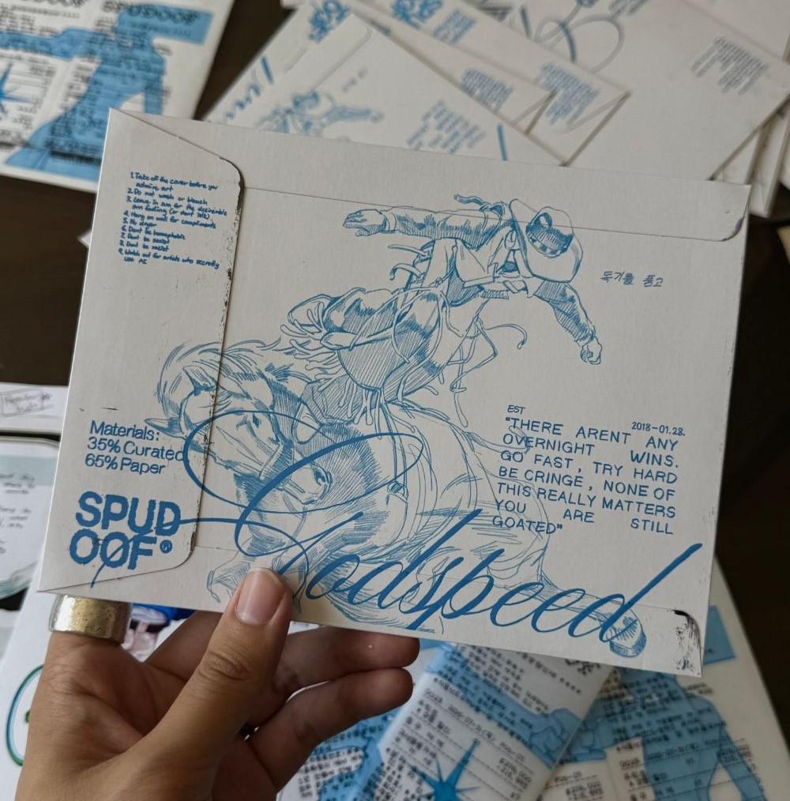
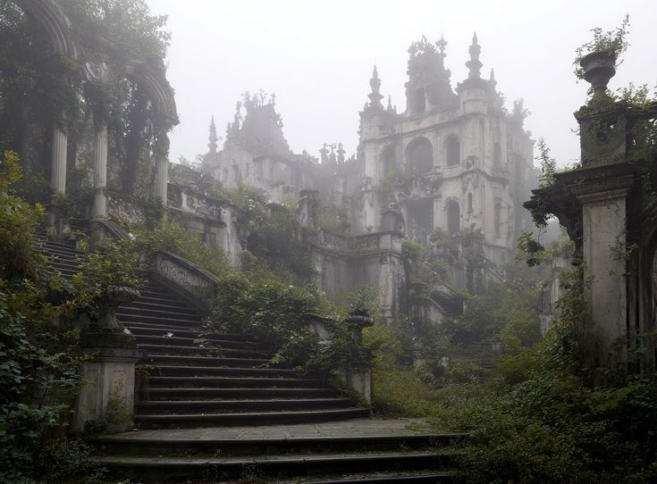
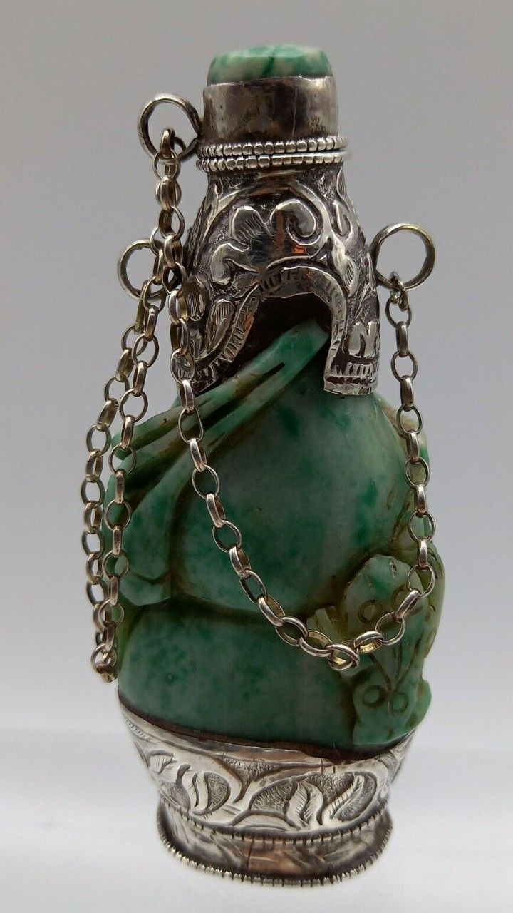
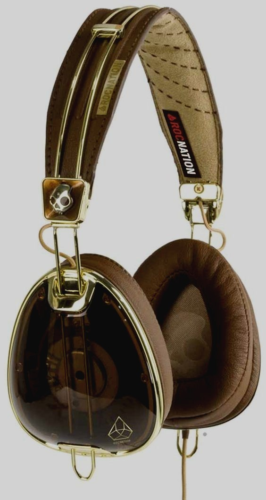
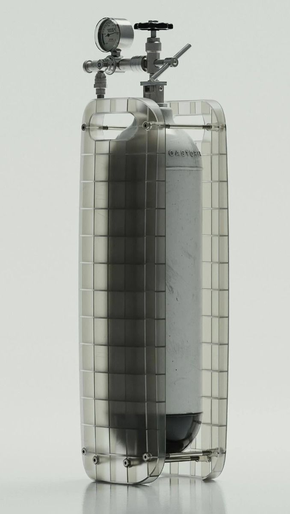

title: What is Design?
banner: assets/theo.jpg

Our most powerful sense is sight. It conveys information unrelentingly and with greater magnitude than any other. It’s constant and independent of time.

Art is sight weaponized. It’s our attempt at taming the visual. Through design, we can apply art to the world we live in.	

Nearly everything we interact with on a daily basis has a visual component, the shape of the desk I’m writing this on, the browser you are viewing this on, the shape and color of these words; they all have visual components. Thus, they all have designs. 

Design has 2 main forms: **industrial** and **graphic**. 

Graphic design refers to the visual orchestration of anything taking two-dimensional space. 

Industrial design refers to the visual orchestration of anything that occupies three-dimensional space.

*Even architecture counts as industrial design!*

