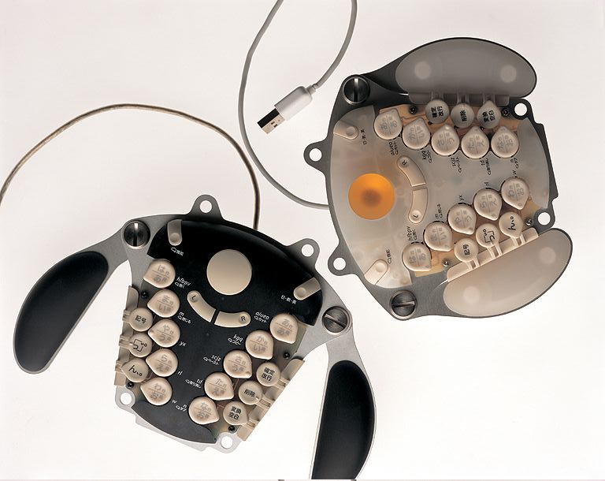
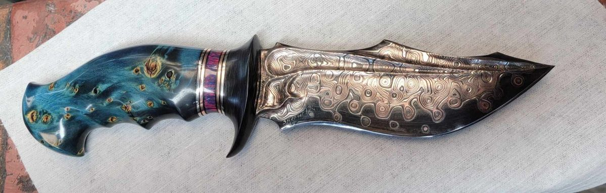
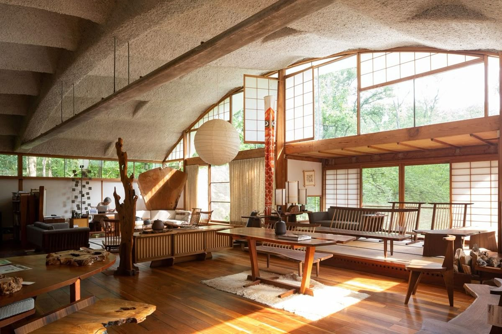
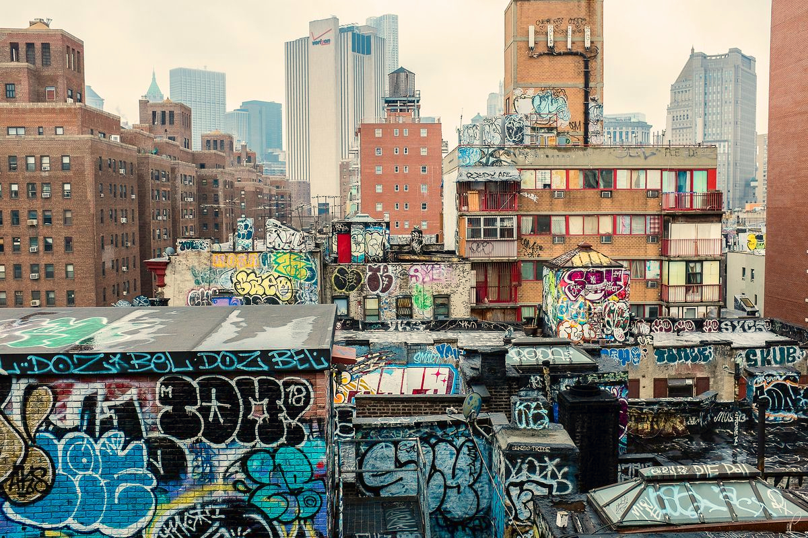
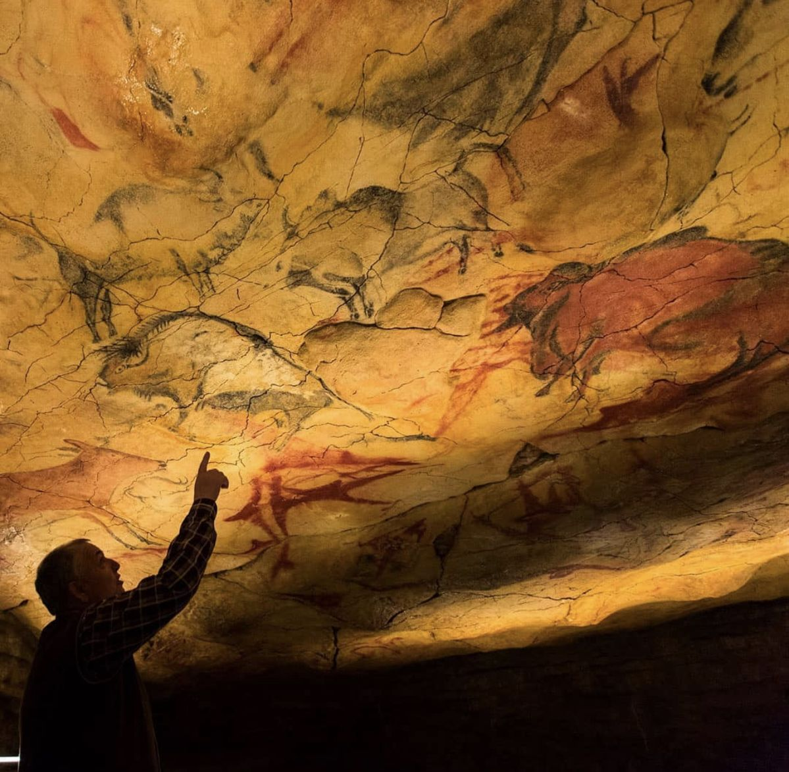
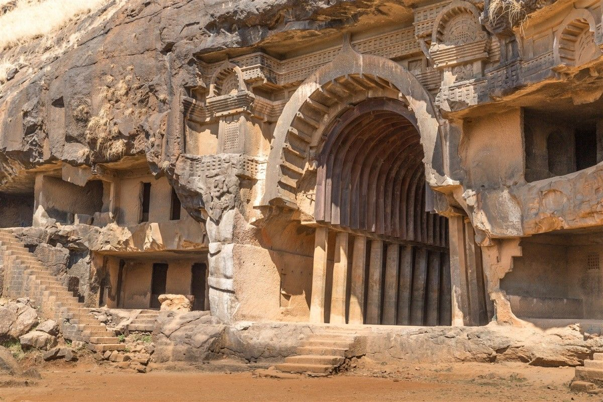

title: Why Design Matters 
banner: assets/ancient35.jpg

I believe when purchasing or interacting with something, you should get value from both the form and function. Form and function are treated as separate concerns, distinct. They’re pitted against each other, and function wins every time. But the form of something (the design) delivers its own return, one that operates on a level deeper than we realize. 

As Bruno Munari explains in Design as Art, “What then is this thing called Design … It is planning: the planning as objectively as possible of everything that goes to make up the surroundings and atmosphere in which men live today” (Munari 35). Design is more than just decoration, its the structural force that defines the items and environments that surround us. It is the planning of creation taken form in the visual. 

# Form Morphs the Mind
The implications of this planning emerges in the use of the object. The visual cues of something and the planning that went behind it can drastically alter the way in which an object is used. It implants subtle notions and beliefs regarding the object. A sharp, light, angular knife implies different mental posture than a blocky, chunky, obtuse one.

The form also impacts the mentality during function. This is best seen in architecture which we are constantly passively interacting with. Allain de Botton puts this best in his essay Architecture, Well-being and the Built Environment: “An ugly room can coagulate any loose suspicions as to the incompleteness of life, while a sun-lit one set with honey-coloured limestone tiles can lend support to whatever is most hopeful within us” (Botton 21). Design is more than just decoration. Visual cues are everpresent and so being in constant interaction with them slowly morphs your psyche. 

Prolonged exposure to these visuals also starts subconsciously effecting what you believe to be possible. Being surrounded by inventive and eccentric work seeps into your subconscious and cultivates the subconscious inspiration necessary to innovate in every facet of life. 

*Graffiti is founded upon the idea that art subconciously seeps into the pysche*

# To Be Human
Dissanayake cites the impact of design and, more largely, art in her work Homo Aestheticus. She says “we create and recreate ourselves through our arts, such that, without them, we would never have become who we are” (Dissanayake 21).

The impact of art and design has been something just intuitively understood by humans. Dissanayake points to our species’ history as proof: despite having modern brains for hundreds of thousands of years, technological progress observed a glacial pace. Not because we couldn’t develop tools but because we didn’t need them, for we had art (Dissanayake 26). This really speaks to something raw and fundamental, Art and design are cultural centerpieces with direct channels to our very being. 

Despite design existing passively, it's the most direct contributor to how you do things, how you feel, and what you aspire to, existing on a fundamental human level. Treating design as a mere byproduct of function and use case would be more than just a disservice to the medium but an affront to the human experience. And after all, "What are humans for? The production of art and the experience of beauty” (Dissanayake 21).

