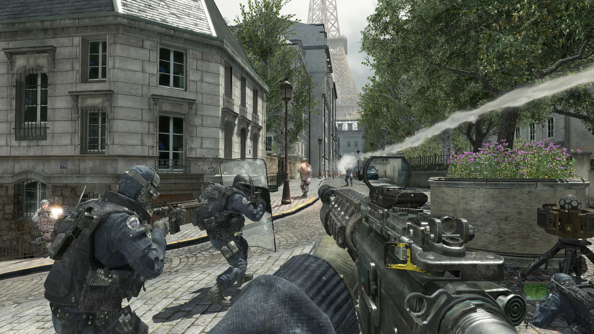
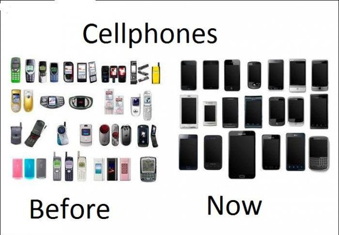
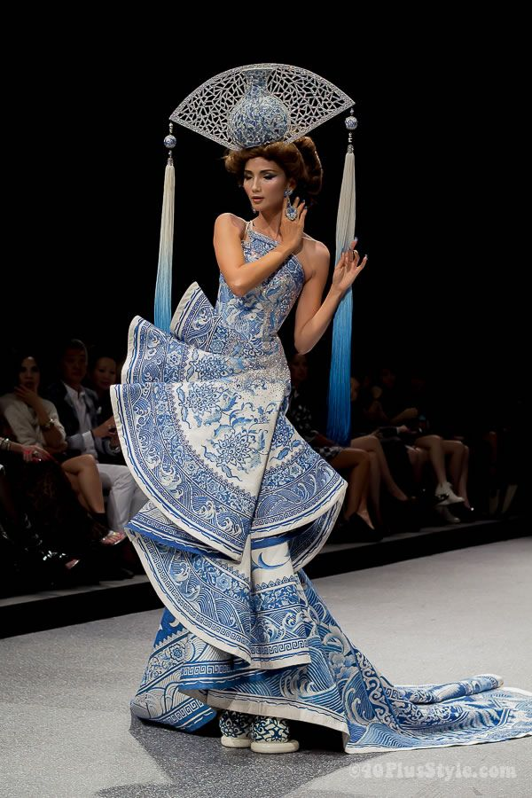
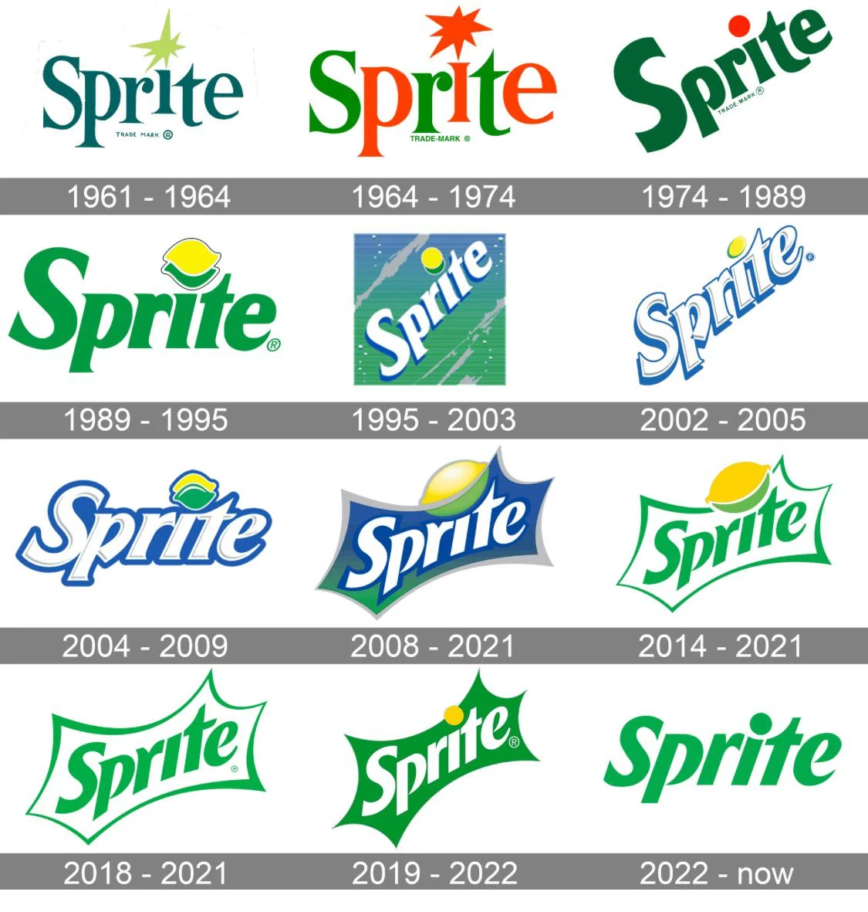

title: So How Does Capitalism Limit Design? 
banner: assets/depressing1.jpg

In our current society, products are the most pervasive way for interaction with design. They are  creations made by an individual or group of individuals (company) for the sake of purchase. In these, design takes a backseat to the function of the product. Innovation in the form of the creation is an afterthought to its function. I believe the economic system that distributes and mediates the creation of these products is what is causing this degradation of design. 

Design being so integral to our daily life means that its perception can be drastically altered. This is what John Berger suggests in Ways of Seeing, stating that our ways of seeing are shaped heavily by what we know or believe (Berger 8). This means that our perception is conditioned by surrounding systems rather than the item of focus. If perception is a child of social and economic construct, that would imply the dominance of capitalism does not only influence the products designed but also how design itself is perceived and the value placed upon it by those creating the products. Capitalism shapes how we're conditioned to value design by regulating how it emerges.

Our economic system naturally concentrates power and profit in the hands of a few individuals or corporations, shaping not only what is produced, but how it is designed. The fundamental structure of companies under capitalism pushes those creating the product far from those actually making the decisions about it. These executives are permitted to make large decisions about products despite being so detached from their actual creation, and thus design is only justified when it directly contributes to revenue or reduces costs. This misalignment of motivations forces creatives to work under strict deadlines, financial constraints, and risk aversion. As a result, design becomes standardized and optimized for efficiency, replacing experimentation and aesthetic depth with conservativity.

# Corporate Hierarchy
The separation between creative and director is why smaller companies typically output the most passionate and inventive work — they are the ones actually creating it. The video game industry exemplifies this perfectly. AAA game studios (those with large budgets and thousands of employees) are often cited as soulless while indie studios (those run only a few hobbyist developers) are praised for their inventiveness. You can clearly observe this difference through the following images. 

Indie Games: 

AAA games:

# Forced Conformity
Together, these forces create a very strong selection pressure on design itself. The more eccentric and risky a design is, the less likely it is to appeal to a mass audience. In the context of capitalism, it becomes less viable and valuable. Thus, companies gravitate towards safer, more familiar and conservative design choices. What actually emerges is not the best design in an artistic sense but just the most profitable one. 

As capitalism has progressed, and the phone industry has matured, we witnessed this behavior firsthand:

The fashion industry is actually an exception of this but it too falls victim to capitalism. To create risky and inventive products, they must charge inordinate prices so the few that do enjoy the product make up for the many that don't.

 

Another hallmark of free-market capitalism is unregulated market competition, founded in the belief that competition encourages inventiveness. However, too much competition creates an industry too afraid to innovate for fear that it will fail. When a competing company does work up the courage and succeeds, all the others are forced to adopt the same thing, stripping it of its uniqueness. The phone industry is the perfect example of this: as one company brings forth some kind of innovation in either form or function, all the others must quickly adopt that same feature or development, lest they fall behind and lose market share to their competitors. Unilateral market deregulation forms a level of homogeneity rather than encouraging innovation.

You can see the various design choices converging. Samsung adopts the rounded corners and Apple adopts the other's bevel design.

# Commodification and Trends As Scapegoats
That homogeneity doesn't just emerge from competition though — it gets furthered, reinforced, and even marketed back to us. Companies have begun justifying their lack of design sense as minimalism. In most instances, minimalism is a failure of the potential of the visual medium and a product of companies incentivized to cut costs at every opportunity. Less visual complexity means less resources spent on design, fewer iterations, and lower production costs — capitalism allows these companies to rebrand a lack of style as a style. Kyle Chayka describes this in A Longing for Less, arguing that minimalism has become something spawned from digital platforms and corporate environments. 

The system Chayka details rewards uniformity and suppresses visual excess. It is not neutral and emergent but a product of a system that prioritizes efficiency and mass compatibility at the expense of aesthetic depth and diversity. Minimalism does not represent a refinement of design but rather the narrowing of its possibilities under capitalism. 

What capitalism does to minimalism, it does to every aesthetic that becomes "succesful". So, in face of all the odds and withstanding all the trials, if some great design does break through? Capitalism squashes that too with commodification. A system driven on profit maximization cannot allow something great to simply exist. It grows impatient and compels outside entities to capitalize on whatever emerges, packaging and selling it back to the masses until it is worn out. 

This is exactly how trends form. Art and design are stripped of any intention or context, mass produced, and diluted until people associate the aesthetic with the cheap copy rather than the original. Chayka expands on this saying, “When popularity takes over it wears away at what made something unique in the first place” (Chayka 73). The success of a design becomes the very thing that destroys it. 

